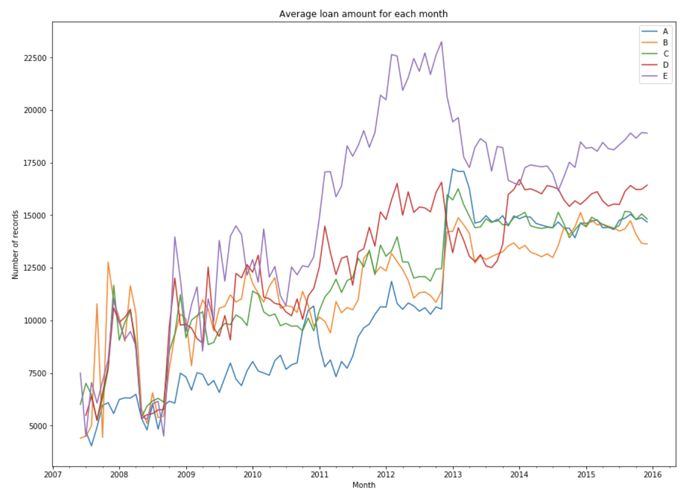

## Findings

* There are not identical member_id in the entire file (using distribution_of_member_id_occurance function).
    * Privacy protection
    * Didn't create a separate table for user.

* Grade A members tend to loan more amount since 2013.

